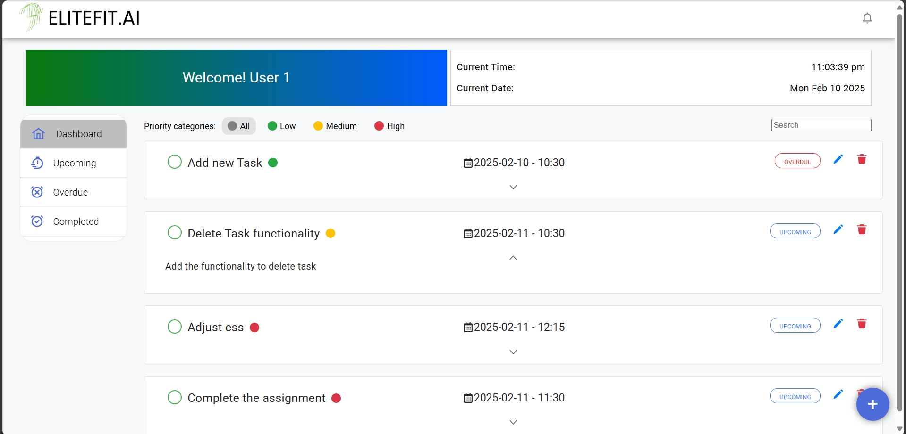

# Tools Used

- Angular
- Angular material library

# Features

**Dash Board**

This is the User Interface

**New Task Creation**

New Task modal

SnackBar is shown at the bottom on successfully adding a new task

**Edit Task**

Edit task modal automatically fills the data for editing

**Delete Task**

Delete confirmation pop up when deleting a task

**Task Status**

Overdue status automatically updates in realtime

The task status us updated to completed by clicking on the check box

**Task Search**

A task can be searched by typing the title in the search bar

**Status Filter**

Filters based on status

**Priority Filter**

Tasks can be filtered in each status filters based on their priority

# Local Setup

For local setup first clone the github repo

`https://github.com/choppa-kiran/kiran-todo.git`

Navigate to project directory

`cd todo-app`

Install AngularCli
`npm install -g @angular/cli@17`

Add Angular Material library
`ng add @angular/material`

Install Snackbar library
`npm install @angular/material @angular/cdk`

Run the application
`npm start`
